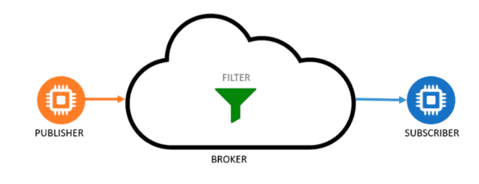

# HCleaning

 ## **1.**  **Descripción del proyecto** 

Controlar la contaminación en varias áreas hoy en día puede ser un gran reto, existen multitudes de empresas que se dedican a la desinfección de distintas salas, estudios, hospitales, oficinas etc. 

 

Las salas blancas, son un espacio cerrado, pensado para mantener unos niveles de contaminación mínimos o casi nulos. Sin embargo, uno de los grandes retos que se enfrenta hoy en día la tecnología, es eliminar cualquier agente infeccioso de todas estas salas, evitando de esta manera, la reinfección de pacientes que se someten a algunas intervenciones quirúrgicas. 

 

El objetivo del proyecto de la evaluación continua es el control y la prevención de la aparición de hongos (concretamente el hongo aspergillus). Este hongo, se encuentra en suspensión en el ambiente, por ello, mi propuesta es realizar o diseñar un sistema de control aplicado a dichas salas blancas, el cual controla, la aparición de hongos aspergillus.

 

Adicionalmente, se controlarán a los usuarios que accedan a las salas blancas y se creará un registro de las operaciones planificadas.

 

A continuación, se realiza una descripción de los pasos que se han ido desarrollando con el objetivo de la creación de dicha herramienta.

## **2.**  **Hardware empleado en la solución**

 

Se adjunta los elementos Hardware que se están empleando en el proyecto

 

Figura 1: Elementos Hardware en la solución

## **3.**  **Diagrama de conexión de los componentes**

 

 

A continuación, se adjunta el diagrama de conexión de los componentes 

    

Figura 2: Diagrama de conexión de los componentes

## **4.**  Modelo de la base de datos

    Figura 3: Modelo de la base de datos 

La base de datos almacenará información sobre los usuarios de la API Rest, las operaciones programadas. Las salas se controlarán con sensores y actuadores y la información de cada uno de estos dispositivos. 

 

Existe una clase DEVICE que controla los dispositivos (actuadores y sensores). Estos dispositivos serán colocados en salas blancas. 

Se mantiene un registro de los usuarios de la API. Estos pueden activar manualmente la acción de los actuadores y llevar un control sobre las operaciones “SURGERY” programadas para tener las salas totalmente listas.

 

 

 

## **5.**  **Descripción de los métodos de la API Rest**

 

El diseño de una API REST, se trata de una creación de una interfaz empleando unas reglas muy bien definidas con el objetivo de interactuar con un sistema y obtener su información.

 

El método REST se basa en la separación de su API en recursos lógicos, donde estos se manipulan mediante peticiones HTTP con **métodos GET, POST, PUT y DELETE.**

 

### **Métodos GET**

Para realizar las consultas a las tablas se ha realizado un método GET para cada tabla que filtra por “id”. 

Casos específicos:

·    SURGERY: Se dispone de métodos GET que filtran por “fecha” y “idRoom” para obtener la información de todas las operaciones programadas para una determinada sala. 

·    DEVICE, SENSOR, ACTUATOR: Los dispositivos disponen métodos GET que filtran por “idSensor” obteniendo de esta manera la información acerca del sensor/actuador a consultar

### **Métodos POST**

 

Se han implementado métodos POST para la inserción de datos. Esta inserción de datos se realiza para unos casos determinados:

·    Añadir un nuevo dispositivo
·    Añadir valores de un sensor
·    Añadir valores de un actuador
·    Añadir una nueva operación

 

###  **Métodos DELETE**

Se ha implementado un método DELETE para la gestión de las operaciones.

 

### **IMPLEMENTACIÓN**

 **DEVICE**

 Descripción peticiones GET: Devuelve la información de un dispositivo filtrado por su idDevice o su idRoom.

 Descripcion peticiones POST: Inserta la informción de un nuevo dispositivo

 Url "getDevice": "/api/device/:idDevice”

 Url "getDeviceRoom": "/api/deviceOf/:idRoom”

 Url "postDevice": "/api/device/new"

**SENSOR**

Descripción peticiones GET: Devuelve la información de un sensor filtrado por su idSensor o su idDevice.

Descripción peticiones POST: Inserta los valores de un sensor

Url "getSensorVales": "/api/sensor/values/:idSensor"

Url "getSensorDevice": "/api/sensorOf/:idDevice”

Url "postSensorValues": "/api/sensor/values/:idSensor"

**ACTUATOR**

Descripción peticiones GET: Devuelve la información de un actuador filtrado por su idActuator o su idDevice.

Descripción peticiones POST: Inserta los valores de un actuador

Url "getActuatorVales": "/api/actuator/values/:idActuator"

Url "getActuatorDevice": "/api/actuatorOf/:idDevice”

Url "postActuatorValues": "/api/actuator/values/:idActuator"

**SURGERY**

Descripción peticiones GET: Devuelve la información de las operaciones filtrado por su idSurgery

Descripción peticiones POST: Inserta una nueva operación

Descripción peticiones DELETE: Elimina una operacion filtrada por su idSurgery

Url "getSurgery": "/api/surgery/:idSurgery"

Url "postSurgery": "/api/surgery/new"

Url "deleteSurgery": "/api/surgery/:idSurgery"

## **6.**  **Descripción de los mensajes MQTT**

Se trata de un protocolo basado en TCP/IP como base de la comunicación. En el caso de la MQTT, hay que tener en cuenta que cada conexión se mantiene abierta siendo reutilizada en cada comunicación.

Su funcionamiento se basa en un servicio de mensajería push con patrón publicador/suscriptor (pub-sub). Este tipo de infraestructura utiliza una conexión cliente con un servidor central conocido como broker, que en nuestro caso es Mosquitto.

    Figura 4: Diagrama descripción mensajes MQTT 

 

En el presente proyecto, nuestra estructura de los mensajes MQTT, se representa mediante el siguiente diagrama.

 
 Figura 5: Diagrama descripción mensajes MQTT (proyecto)

En resumen, el cliente desde la aplicación web, elige el actuador que desea activar manualmente y envía un mensaje MQTT el cual llegará al servidor y el cliente “ESP8266” previamente suscrito al topic, recibirá el mensaje alterando el estado del actuador.